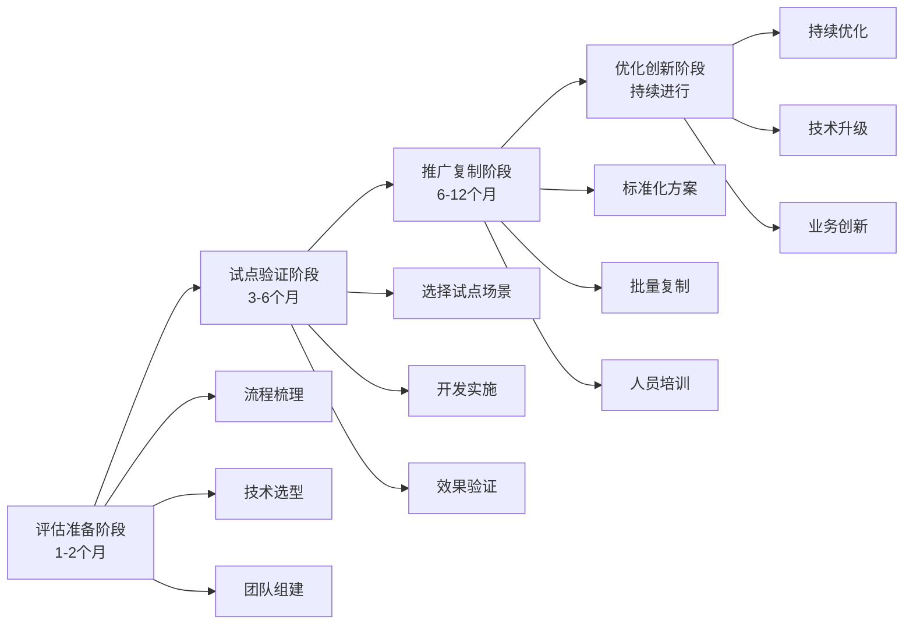

> 研究日期：2026-05-17  
> 文章来源：3篇高质量技术文章  
> 更新频率：建议每6个月更新一次  

---

## 📌 技术概述

**Transformation Automation（转型自动化）** 是企业数字化转型的核心驱动力，通过RPA（机器人流程自动化）、AI智能体、物联网和智能制造技术，实现业务流程的自动化、智能化和数据驱动决策。主要适用于企业降本增效、跨系统集成、生产自动化和质量管控等场景。

**核心价值**：效率提升10-20倍、准确率接近100%、实现24小时不间断运营

---

## 🎯 核心概念

### 1. RPA（机器人流程自动化）
- **专业解释**：通过模拟人类与计算机交互过程，处理跨系统、跨平台的重复性工作流
- **通俗类比**：像数字机器人替代人类做"复制粘贴"、"数据录入"等机械操作
- **核心价值**：非侵入式部署、快速实施、效率提升10-20倍

### 2. AI智能体（AI Agent）
- **专业解释**：基于大模型决策+自动化引擎执行的智能系统，可处理复杂决策场景
- **通俗类比**：像有大脑的数字员工，不仅能执行，还能理解和决策
- **核心价值**：解决RPA无法处理的非结构化数据问题，效率提升400%+

### 3. 多阶段数字化转型
- **专业解释**：从基础设施→数据集中→智能化→业务模式重构的渐进式转型路径
- **通俗类比**：像盖房子，先打地基（信息化），再建框架（数据化），最后精装修（智能化）
- **核心价值**：降低转型风险，确保每一步都有实际收益

---

## 🔧 技术选型与实施路径

### 数字化转型四阶段模型

#### **阶段1：基础设施建设（0-6个月）**
**目标**：业务流程线上化，打通信息流

**核心任务**：
- 部署ERP、MES等基础信息化系统
- 建立数据采集基础设施
- 实现核心业务流程数字化

**技术栈推荐**：
```bash
# ERP系统选择
- SAP S/4HANA（大型企业）
- 用友U8/NC（中型企业）
- Odoo（开源方案）

# MES系统选择
- 西门子SIMATIC IT
- GE Proficy
- 开源方案：OpenMES
```

**验证方法**：
```bash
# 检查系统连通性
ping erp.internal.company.com

# 验证数据采集
curl -X GET http://mes-api.internal/production/status \
  -H "Authorization: Bearer YOUR_TOKEN"
```

#### **阶段2：数据集中与治理（6-12个月）**
**目标**：整合各部门数据，建立统一数据平台

**核心任务**：
- 建立数据治理框架
- 部署数据仓库/数据湖
- 实现数据质量监控

**技术实现**：
```python
# 数据质量检查示例
import pandas as pd
from great_expectations import DataContext

def validate_data_quality(df):
    """验证数据质量"""
    context = DataContext()
    batch = context.get_batch(df, "production_data")
    
    validation_results = batch.validate()
    
    if validation_results["statistics"]["success_percent"] < 95:
        raise Exception("数据质量不达标，需清洗处理")
    
    return True

# 使用示例
production_data = pd.read_csv("production.csv")
validate_data_quality(production_data)
```

**推荐工具**：
- **数据治理**：Apache Atlas, Collibra
- **数据质量**：Great Expectations, Deequ
- **数据仓库**：Snowflake, Databricks, ClickHouse

#### **阶段3：智能化提升（12-24个月）**
**目标**：引入AI和自动化技术，实现业务智能化

**核心任务**：
- 部署RPA机器人处理重复流程
- 实施预测性维护
- 建立智能决策支持系统

#### **阶段4：业务模式重构（24个月+）**
**目标**：基于数据驱动重构商业模式

**核心任务**：
- 构建生态协同平台
- 开发数据产品
- 实现全产业链智能化

---

## 🔨 后期维护指南

### 监控与运维

**1. 日志查看与分析**
```bash
# RPA机器人运行日志
tail -f /var/log/rpa-bot/execution.log | grep ERROR

# AI智能体决策日志
kubectl logs -f deployment/ai-agent -n production | grep "decision_made"

# 系统性能监控
prometheus-cli query 'rate(process_cpu_seconds_total[5m])'
```

**2. 性能监控指标**
```yaml
# 关键指标配置
metrics:
  rpa:
    - name: execution_time
      threshold: 300  # 5分钟
    - name: success_rate
      threshold: 0.95  # 95%
    - name: cost_savings
      calculation: "manual_hours_saved * hourly_rate"
  
  ai_agent:
    - name: response_time
      threshold: 2000  # 2秒
    - name: decision_accuracy
      threshold: 0.90  # 90%
```

**3. 备份策略**
```bash
#!/bin/bash
# 每日备份脚本
BACKUP_DIR="/backup/automation_$(date +%Y%m%d)"
mkdir -p $BACKUP_DIR

# 备份RPA配置
cp -r /opt/rpa/config $BACKUP_DIR/

# 备份AI模型
kubectl get cm ai-model-config -o yaml > $BACKUP_DIR/model_config.yaml

# 备份到云存储
aws s3 sync $BACKUP_DIR s3://company-backups/automation/
```

### 常见问题排查

**问题1：RPA机器人执行失败**
```bash
# 诊断步骤
1. 检查日志
   grep "ERROR" /var/log/rpa-bot/execution.log | tail -20

2. 验证目标系统可访问性
   curl -I https://target-system.com

3. 检查凭证是否过期
   vault read secret/rpa/credentials
```

**问题2：AI智能体响应慢**
```bash
# 性能优化
1. 检查资源使用
   kubectl top pod -l app=ai-agent

2. 扩容处理
   kubectl scale deployment ai-agent --replicas=3

3. 启用缓存
   curl -X POST http://ai-agent:8080/admin/cache/enable
```

---

## 💡 实战场景

### 场景1：财务对账自动化（RPA）

**需求**：某集团公司每月需要处理10+家银行账户的对账工作，财务团队需要手动登录各银行网银、下载流水、核对差异，耗时400+小时，且容易出现人为错误。

**方案**：使用RPA机器人实现银行对账全流程自动化

**实现**：
```python
# RPA银行对账机器人核心逻辑
from rpa_framework import Browser, Excel, Email
import logging

class BankReconciliationBot:
    def __init__(self):
        self.browser = Browser()
        self.excel = Excel()
        self.logger = logging.getLogger(__name__)
    
    def run(self, bank_config):
        """执行对账流程"""
        try:
            # 1. 登录银行系统
            self.browser.goto(bank_config['url'])
            self.browser.input('username', bank_config['username'])
            self.browser.input('password', bank_config['password'])
            self.browser.click('login_button')
            
            # 2. 导出银行流水
            self.browser.wait_for_element('account_summary')
            transactions = self.browser.extract_table('transaction_table')
            
            # 3. 与内部系统对比
            internal_data = self.excel.read('internal_records.xlsx')
            differences = self.compare_transactions(transactions, internal_data)
            
            # 4. 生成对账报告
            report = self.generate_report(differences, bank_config['bank_name'])
            self.excel.save(report, f"reconciliation_{bank_config['bank_name']}.xlsx")
            
            # 5. 发送通知
            if differences:
                self.send_alert(differences, bank_config)
            
            self.logger.info(f"{bank_config['bank_name']} 对账完成")
            return True
            
        except Exception as e:
            self.logger.error(f"对账失败: {str(e)}")
            return False
    
    def compare_transactions(self, bank_data, internal_data):
        """对比交易差异"""
        differences = []
        
        for transaction in bank_data:
            match = self.find_matching_transaction(transaction, internal_data)
            if not match:
                differences.append({
                    'date': transaction['date'],
                    'amount': transaction['amount'],
                    'type': 'only_in_bank'
                })
        
        return differences
    
    def send_alert(self, differences, bank_config):
        """发送差异通知"""
        email = Email()
        email.send(
            to=bank_config['alert_email'],
            subject=f"对账差异提醒 - {bank_config['bank_name']}",
            body=f"发现 {len(differences)} 笔差异交易，请及时处理"
        )

# 配置文件
bank_configs = [
    {
        'bank_name': 'ICBC',
        'url': 'https://icbc.com.cn/login',
        'username': '${ICBC_USERNAME}',
        'password': '${ICBC_PASSWORD}',
        'alert_email': 'finance@company.com'
    },
    # 其他银行配置...
]

# 执行对账
bot = BankReconciliationBot()
for config in bank_configs:
    bot.run(config)
```

**效果**：
- 对账时间从400小时降至20小时（效率提升95%）
- 准确率从85%提升至100%
- 每年节省人力成本约50万元

**注意**：
- 银行网站UI变化会导致RPA失效，需定期维护
- 敏感信息（密码）需使用密钥管理（如HashiCorp Vault）
- 建议配置监控告警，机器人异常时及时通知

---

### 场景2：采购对账自动化（AI智能体）

**需求**：某制造企业每月需要处理1000+份采购订单的对账工作，涉及供应商数量多、数据格式不统一、需要理解合同条款进行智能判断，传统RPA无法处理。

**方案**：使用AI智能体实现智能对账，结合大模型理解和自动化执行

**实现**：
```python
# AI智能体采购对账系统
from langchain.agents import AgentExecutor, create_openai_tools_agent
from langchain.tools import Tool
from langchain_openai import ChatOpenAI
import pandas as pd

class ProcurementReconciliationAgent:
    def __init__(self):
        self.llm = ChatOpenAI(model="gpt-4", temperature=0)
        self.tools = self._setup_tools()
        self.agent = self._create_agent()
    
    def _setup_tools(self):
        """配置Agent工具集"""
        return [
            Tool(
                name="query_po_system",
                func=self.query_purchase_orders,
                description="查询采购订单系统获取订单信息"
            ),
            Tool(
                name="query_invoice",
                func=self.query_invoices,
                description="查询发票信息"
            ),
            Tool(
                name="analyze_contract",
                func=self.analyze_contract_terms,
                description="分析合同条款理解付款条件"
            ),
            Tool(
                name="calculate_variance",
                func=self.calculate_price_variance,
                description="计算价格差异"
            ),
            Tool(
                name="generate_report",
                func=self.generate_reconciliation_report,
                description="生成对账报告"
            )
        ]
    
    def _create_agent(self):
        """创建智能体"""
        agent = create_openai_tools_agent(
            self.llm,
            self.tools,
            prompt=self._get_agent_prompt()
        )
        return AgentExecutor(
            agent=agent,
            tools=self.tools,
            verbose=True,
            max_iterations=10
        )
    
    def _get_agent_prompt(self):
        """Agent系统提示词"""
        return """你是采购对账智能体，负责自动化处理采购对账任务。
        
工作流程：
1. 获取采购订单和发票数据
2. 分析合同条款理解付款条件
3. 对比订单、收货、发票信息
4. 计算价格差异并识别异常
5. 生成对账报告和处理建议

注意事项：
- 金额差异超过5%需要特别关注
- 付款条件不符需要标记为风险
- 多次出现差异的供应商需要预警
"""
    
    def reconcile_batch(self, invoice_ids):
        """批量对账"""
        results = []
        
        for invoice_id in invoice_ids:
            try:
                result = self.agent.invoke({
                    "input": f"请对发票 {invoice_id} 进行对账处理"
                })
                results.append({
                    'invoice_id': invoice_id,
                    'status': 'success',
                    'result': result['output']
                })
            except Exception as e:
                results.append({
                    'invoice_id': invoice_id,
                    'status': 'failed',
                    'error': str(e)
                })
        
        return results
    
    # 工具函数实现
    def query_purchase_orders(self, po_number: str) -> str:
        """查询采购订单"""
        # 实际实现中连接ERP系统
        return f"订单号: {po_number}, 供应商: ABC公司, 金额: 10000元"
    
    def query_invoices(self, invoice_id: str) -> str:
        """查询发票信息"""
        # 实际实现中连接发票系统
        return f"发票号: {invoice_id}, 金额: 10500元, 开票日期: 2026-05-01"
    
    def analyze_contract_terms(self, supplier: str) -> str:
        """分析合同条款"""
        # 实际实现中使用LLM分析合同文档
        return "付款条件: 月结30天, 价格条款: 不含税价"
    
    def calculate_price_variance(self, po_amount: float, invoice_amount: float) -> str:
        """计算价格差异"""
        variance = ((invoice_amount - po_amount) / po_amount) * 100
        return f"价格差异: {variance:.2f}%"
    
    def generate_reconciliation_report(self, data: str) -> str:
        """生成对账报告"""
        # 实际实现中生成Excel或PDF报告
        return "对账报告已生成"

# 使用示例
agent = ProcurementReconciliationAgent()
invoice_list = ['INV001', 'INV002', 'INV003']
results = agent.reconcile_batch(invoice_list)

print(f"对账完成: {len([r for r in results if r['status'] == 'success'])}/{len(results)}")
```

**效果**：
- 对账效率提升400%（从人工3天降至智能体2小时）
- 异常识别准确率从70%提升至95%
- 每年避免约200万元的错误付款

**注意**：
- AI智能体需要训练数据，前期需要积累样本
- 成本较高，建议优先应用在高价值场景
- 需要建立人工审核机制处理边界情况

---

### 场景3：生产线设备预测性维护（智能制造）

**需求**：某制造企业关键设备意外停机导致每月约20小时生产中断，损失约50万元。传统定期维护方式效率低，无法提前发现潜在故障。

**方案**：基于IoT数据+AI模型的预测性维护系统

**实现**：
```python
# 预测性维护系统
from tensorflow import keras
import numpy as np
import pandas as pd
from sklearn.preprocessing import StandardScaler

class PredictiveMaintenanceSystem:
    def __init__(self):
        self.model = self.build_lstm_model()
        self.scaler = StandardScaler()
    
    def build_lstm_model(self):
        """构建LSTM预测模型"""
        model = keras.Sequential([
            keras.layers.LSTM(64, input_shape=(100, 6), return_sequences=True),
            keras.layers.Dropout(0.2),
            keras.layers.LSTM(32),
            keras.layers.Dropout(0.2),
            keras.layers.Dense(16, activation='relu'),
            keras.layers.Dense(1, activation='sigmoid')
        ])
        
        model.compile(
            optimizer='adam',
            loss='binary_crossentropy',
            metrics=['accuracy']
        )
        
        return model
    
    def train(self, sensor_data, labels):
        """训练模型"""
        # 数据预处理
        scaled_data = self.scaler.fit_transform(sensor_data)
        
        # 创建时间序列样本
        X, y = self.create_sequences(scaled_data, labels)
        
        # 训练模型
        self.model.fit(X, y, epochs=50, batch_size=32, validation_split=0.2)
    
    def predict_failure_probability(self, recent_sensor_data):
        """预测故障概率"""
        scaled_data = self.scaler.transform(recent_sensor_data)
        X = scaled_data.reshape(1, 100, 6)
        
        probability = self.model.predict(X)[0][0]
        
        return probability
    
    def create_sequences(self, data, labels, sequence_length=100):
        """创建时间序列数据"""
        X, y = [], []
        
        for i in range(len(data) - sequence_length):
            X.append(data[i:i+sequence_length])
            y.append(labels[i+sequence_length])
        
        return np.array(X), np.array(y)

# 数据采集模块
import pika
import json

class SensorDataCollector:
    def __init__(self, rabbitmq_url='amqp://localhost'):
        self.connection = pika.BlockingConnection(pika.URLParameters(rabbitmq_url))
        self.channel = self.connection.channel()
        self.channel.queue_declare(queue='sensor_data')
    
    def collect_data(self, equipment_id):
        """采集传感器数据"""
        # 模拟采集6个传感器数据
        sensor_data = {
            'equipment_id': equipment_id,
            'timestamp': int(time.time()),
            'temperature': np.random.normal(75, 5),  # 温度
            'vibration': np.random.normal(0.5, 0.1),  # 振动
            'pressure': np.random.normal(100, 10),    # 压力
            'current': np.random.normal(15, 2),       # 电流
            'noise': np.random.normal(60, 5),         # 噪音
            'flow_rate': np.random.normal(50, 3)      # 流量
        }
        
        # 发送到消息队列
        self.channel.basic_publish(
            exchange='',
            routing_key='sensor_data',
            body=json.dumps(sensor_data)
        )
        
        return sensor_data

# 集成应用
class MaintenanceAutomationOrchestrator:
    def __init__(self):
        self.predictor = PredictiveMaintenanceSystem()
        self.collector = SensorDataCollector()
    
    def run_continuous_monitoring(self, equipment_id):
        """连续监控设备状态"""
        buffer = []
        
        while True:
            # 采集数据
            data = self.collector.collect_data(equipment_id)
            buffer.append([
                data['temperature'],
                data['vibration'],
                data['pressure'],
                data['current'],
                data['noise'],
                data['flow_rate']
            ])
            
            # 保持100个数据点的窗口
            if len(buffer) > 100:
                buffer.pop(0)
                
                # 预测故障概率
                if len(buffer) == 100:
                    failure_prob = self.predictor.predict_failure_probability(
                        np.array(buffer)
                    )
                    
                    # 高风险预警
                    if failure_prob > 0.8:
                        self.send_alert(equipment_id, failure_prob)
                        self.schedule_maintenance(equipment_id)
            
            time.sleep(60)  # 每分钟采集一次
    
    def send_alert(self, equipment_id, probability):
        """发送维护预警"""
        print(f"⚠️ 预警: 设备 {equipment_id} 故障概率 {probability:.2%}")
        # 实际实现中发送邮件/短信/工单系统
    
    def schedule_maintenance(self, equipment_id):
        """安排维护工单"""
        # 实际实现中对接EAM系统
        print(f"🔧 已为设备 {equipment_id} 创建维护工单")

# 使用示例
orchestrator = MaintenanceAutomationOrchestrator()
orchestrator.run_continuous_monitoring("EQUIPMENT_001")
```

**系统架构图**：
```
┌─────────────┐     ┌─────────────┐     ┌─────────────┐
│  传感器层   │────▶│  数据采集   │────▶│  消息队列   │
│ (IoT设备)   │     │  (Edge)     │     │ (RabbitMQ)  │
└─────────────┘     └─────────────┘     └─────────────┘
                                               │
                                               ▼
┌─────────────┐     ┌─────────────┐     ┌─────────────┐
│  维护工单   │◀────│  AI预测引擎 │◀────│  流式处理   │
│  (EAM系统)  │     │  (LSTM模型) │     │ (Flink/Spark)│
└─────────────┘     └─────────────┘     └─────────────┘
```

**效果**：
- 设备意外停机时间减少80%（从20小时/月降至4小时/月）
- 维护成本降低30%（从定期维护转为预测性维护）
- 每年避免损失约400万元

**注意**：
- 需要至少6个月的历史故障数据训练模型
- 传感器数据质量直接影响预测准确性
- 建议从单台设备试点，验证效果后推广

---

## ⚙️ 核心配置模板

### RPA机器人配置模板

```yaml
# rpa-bot-config.yaml
bots:
  - name: finance_reconciliation
    type: web_automation
    schedule: "0 2 * * *"  # 每天凌晨2点执行
    
    credentials:
      bank_icbc:
        url: https://icbc.com.cn
        username: "${VAULT_PATH:icbc/username}"
        password: "${VAULT_PATH:icbc/password}"
    
    settings:
      headless: true
      screenshot_on_error: true
      max_retries: 3
      timeout: 300
    
    notification:
      on_success:
        - type: email
          to: finance-team@company.com
      on_failure:
        - type: slack
          webhook: "${SLACK_WEBHOOK}"
        - type: email
          to: ops@company.com

resources:
  max_memory: "2Gi"
  max_cpu: "1"
```

### AI智能体配置模板

```yaml
# ai-agent-config.yaml
agent:
  name: procurement_agent
  model: gpt-4-turbo
  temperature: 0
  max_tokens: 2000
  
  tools:
    - name: query_po_system
      type: api
      endpoint: http://erp-api.internal/po/{po_number}
      method: GET
      auth:
        type: bearer
        token: "${ERP_API_TOKEN}"
    
    - name: analyze_document
      type: llm
      model: gpt-4-vision
      prompt: "请分析这份采购合同的关键条款"
  
  memory:
    type: redis
    host: redis.internal
    port: 6379
    ttl: 3600
  
  monitoring:
    log_level: INFO
    trace_enabled: true
    metrics_enabled: true

safety:
  max_cost_per_run: 10.0  # 单次运行最大成本（美元）
  human_review_required: true
  approval_threshold: 50000  # 超过5万元需要人工审批
```

---

## 🚨 常见陷阱与解决方案

### 陷阱1：过度追求自动化，忽视流程优化

**问题现象**：
- 直接自动化现有低效流程
- 自动化后反而固化了不合理流程
- 效率提升不明显

**根本原因**：
- 未在自动化前进行流程梳理和优化
- 缺乏"先优化，后自动化"的原则

**解决方案**：
```python
# 流程优化评估框架
def process_readiness_assessment(current_process):
    """评估流程是否适合自动化"""
    score = 0
    issues = []
    
    # 检查1：流程是否标准化
    if not current_process['is_standardized']:
        issues.append("流程未标准化，需先制定SOP")
    else:
        score += 25
    
    # 检查2：流程是否稳定
    if current_process['change_frequency'] > 5:
        issues.append("流程变更频繁（>5次/月），不建议自动化")
    else:
        score += 25
    
    # 检查3：是否有明确规则
    if not current_process['has_clear_rules']:
        issues.append("缺乏明确的业务规则，需先梳理")
    else:
        score += 25
    
    # 检查4：ROI是否合理
    if current_process['manual_cost'] < 1000:
        issues.append("当前人工成本过低，自动化ROI不明确")
    else:
        score += 25
    
    return {
        'score': score,
        'ready': score >= 75,
        'issues': issues
    }

# 使用示例
assessment = process_readiness_assessment({
    'name': '发票审核',
    'is_standardized': True,
    'change_frequency': 2,
    'has_clear_rules': True,
    'manual_cost': 5000
})

if assessment['ready']:
    print("✅ 流程适合自动化")
else:
    print(f"❌ {assessment['issues']}")
```

**预防措施**：
- 建立流程优化评估机制
- 实施"精益+自动化"双重策略
- 定期回顾自动化流程的合理性

---

### 陷阱2：忽视系统集成，导致数据孤岛

**问题现象**：
- RPA机器人在系统间搬运数据，效率低下
- 数据不一致，频繁出错
- 维护成本高

**根本原因**：
- 未优先考虑API集成
- 过度依赖RPA做系统集成

**解决方案**：
```python
# 集成方式决策树
def decide_integration_method(source_system, target_system, data_volume, frequency):
    """决策最佳集成方式"""
    
    # 优先级1：检查是否有原生API
    if source_system['has_api'] and target_system['has_api']:
        return {
            'method': 'API Integration',
            'framework': 'Apache Camel / MuleSoft',
            'reason': '实时性高、维护成本低',
            'implementation': """
# API集成示例
from camel import RouteBuilder

class IntegrationRoute(RouteBuilder):
    def configure(self):
        self.from("direct:sourceSystem") \
            .to("https://api.target-system.com/v1/data") \
            .process(lambda x: self.transform_data(x)) \
            .to("log:compliance?level=INFO")
            """
        }
    
    # 优先级2：考虑数据库集成
    elif data_volume > 100000 and frequency == 'batch':
        return {
            'method': 'Database Integration',
            'framework': 'Apache NiFi / Airflow',
            'reason': '适合大批量数据传输',
            'implementation': """
# 数据库集成示例
import airflow
from airflow import DAG
from airflow.providers.postgres.operators.postgres import PostgresOperator

dag = DAG('data_sync', schedule_interval='@daily')

sync_task = PostgresOperator(
    task_id='sync_data',
    postgres_conn_id='target_db',
    sql='INSERT INTO target_table SELECT * FROM source_table',
    dag=dag
)
            """
        }
    
    # 优先级3：事件驱动集成
    elif frequency == 'real-time':
        return {
            'method': 'Event-Driven Architecture',
            'framework': 'Kafka / RabbitMQ',
            'reason': '实时性要求高',
            'implementation': """
# 事件驱动集成示例
from kafka import KafkaProducer

producer = KafkaProducer(
    bootstrap_servers=['kafka.internal:9092'],
    value_serializer=lambda v: json.dumps(v).encode('utf-8')
)

# 发布数据变更事件
producer.send('data.change', {
    'source': 'system_a',
    'entity_id': '12345',
    'change_type': 'update',
    'data': {...}
})
            """
        }
    
    # 最后选择：RPA
    else:
        return {
            'method': 'RPA',
            'framework': 'UiPath / Automation Anywhere / 自研',
            'reason': '无API、低频次、非实时',
            'implementation': """
# RPA作为最后选择
只有当以上方法都不可行时，才考虑使用RPA
            """
        }

# 使用示例
recommendation = decide_integration_method(
    source_system={'has_api': False},
    target_system={'has_api': True},
    data_volume=50000,
    frequency='batch'
)

print(f"推荐集成方式: {recommendation['method']}")
print(f"原因: {recommendation['reason']}")
```

**预防措施**：
- 新系统采购时强制要求API能力
- 优先使用iPaaS（集成平台即服务）工具
- RPA仅作为最后的集成手段

---

### 陷阱3：AI智能体幻觉导致业务错误

**问题现象**：
- AI智能体编造不存在的信息
- 自信地给出错误建议
- 导致业务决策失误

**根本原因**：
- 大模型的生成特性导致幻觉
- 缺乏事实验证机制

**解决方案**：
```python
# AI智能体事实验证框架
class FactCheckingAgent:
    def __init__(self):
        self.llm = ChatOpenAI(model="gpt-4")
        self.knowledge_base = self._load_knowledge_base()
    
    def _load_knowledge_base(self):
        """加载企业知识库"""
        # 从文档、数据库、API加载可信数据
        return {
            'suppliers': self._load_supplier_data(),
            'contracts': self._load_contract_data(),
            'price_history': self._load_price_data()
        }
    
    def query_with_fact_check(self, user_query):
        """带事实验证的查询"""
        # Step 1: AI生成初步回答
        initial_answer = self.llm.predict(user_query)
        
        # Step 2: 提取需要验证的事实
        facts_to_verify = self._extract_facts(initial_answer)
        
        # Step 3: 逐条验证
        verification_results = []
        for fact in facts_to_verify:
            result = self._verify_fact(fact)
            verification_results.append(result)
        
        # Step 4: 评估可信度
        credibility_score = self._calculate_credibility(verification_results)
        
        # Step 5: 根据可信度决定回答策略
        if credibility_score >= 0.9:
            return {
                'answer': initial_answer,
                'confidence': 'high',
                'sources': [r['source'] for r in verification_results]
            }
        elif credibility_score >= 0.7:
            return {
                'answer': initial_answer,
                'confidence': 'medium',
                'warning': '部分信息未完全验证，建议人工确认',
                'unverified_facts': [r for r in verification_results if not r['verified']]
            }
        else:
            return {
                'answer': '抱歉，我无法确认该信息的准确性，建议人工处理',
                'confidence': 'low',
                'reason': '关键事实无法验证'
            }
    
    def _verify_fact(self, fact):
        """验证单个事实"""
        # 在知识库中搜索
        for source, data in self.knowledge_base.items():
            if self._fact_in_data(fact, data):
                return {
                    'fact': fact,
                    'verified': True,
                    'source': source,
                    'confidence': 'high'
                }
        
        # 尝试通过外部API验证
        if self._verify_via_external_api(fact):
            return {
                'fact': fact,
                'verified': True,
                'source': 'external_api',
                'confidence': 'medium'
            }
        
        return {
            'fact': fact,
            'verified': False,
            'source': None,
            'confidence': 'low'
        }

# 使用示例
agent = FactCheckingAgent()
result = agent.query_with_fact_check("供应商ABC的付款条件是什么？")

if result['confidence'] == 'high':
    print(f"✅ {result['answer']}")
else:
    print(f"⚠️ {result.get('warning', '需要人工确认')}")
```

**预防措施**：
- 建立企业知识库作为事实依据
- 实施可信度评分机制
- 高风险决策必须有人工审核

---

### 陷阱4：忽视员工培训和变革管理

**问题现象**：
- 员工抵触自动化系统
- 系统上线后使用率低
- 回到人工操作模式

**根本原因**：
- 未充分沟通自动化带来的价值
- 缺乏系统培训
- 担心被裁员

**解决方案**：
```python
# 变革管理计划生成器
class ChangeManagementPlanner:
    def __init__(self, automation_project):
        self.project = automation_project
    
    def generate_plan(self):
        """生成变革管理计划"""
        plan = {
            'phase_1_awareness': {
                'duration': '2周',
                'activities': [
                    '全员启动会，解释自动化愿景',
                    '部门宣讲会，解答疑虑',
                    '内部宣传材料（海报、邮件）'
                ],
                'kpi': '员工知晓率达到100%'
            },
            'phase_2_desire': {
                'duration': '4周',
                'activities': [
                    '识别并培训变革 champions',
                    '展示试点项目的成功案例',
                    '一对一沟通关键员工'
                ],
                'kpi': '支持率达到70%'
            },
            'phase_3_knowledge': {
                'duration': '6周',
                'activities': [
                    '分角色培训课程',
                    '操作手册和视频教程',
                    '沙盒环境练习',
                    '认证考试'
                ],
                'kpi': '培训通过率95%'
            },
            'phase_4_ability': {
                'duration': '4周',
                'activities': [
                    '导师制度（老带新）',
                    '渐进式上线（先影子运行）',
                    '实时支持热线'
                ],
                'kpi': '独立操作率达到90%'
            },
            'phase_5_reinforcement': {
                'duration': '持续',
                'activities': [
                    '定期反馈会议',
                    '最佳实践分享',
                    '持续改进机制'
                ],
                'kpi': '系统使用率保持>80%'
            }
        }
        
        return plan
    
    def generate_communication_messages(self):
        """生成沟通信息"""
        return {
            'to_employees': """
亲爱的同事：

公司即将引入自动化系统，这不是为了替代大家，而是为了：

1. **消除重复劳动**：让大家从繁琐的事务性工作中解放出来
2. **提升工作价值**：将精力转移到更有创造性的任务
3. **职业发展**：提供自动化技能培训，提升个人竞争力

我们承诺：
✅ 不会因自动化裁员
✅ 会提供转岗培训
✅ 会重新设计工作内容

让我们一起迎接更高效的工作方式！
            """,
            
            'to_managers': """
管理者请注意：

自动化上线后，您的角色将转变为：

1. **流程设计者**：设计并优化自动化流程
2. **异常处理者**：处理自动化无法解决的复杂情况
3. **团队教练**：指导团队使用新工具

管理重点：
- 关注员工情绪和抵触
- 及时发现和解决问题
- 认可和奖励适应变化快的员工
            """
        }

# 使用示例
planner = ChangeManagementPlanner({
    'name': '财务对账自动化',
    'affected_employees': 20,
    'go_live_date': '2026-07-01'
})

plan = planner.generate_plan()
print(f"变革管理计划: {plan}")
```

**预防措施**：
- 早期让员工参与自动化项目
- 明确承诺不裁员，提供转岗培训
- 将节省的时间重新分配到高价值工作

---

## 🔗 资源推荐

### 官方文档
- [RPA最佳实践 - UiPath Documentation](https://docs.uipath.com/)
- [LangChain Agent开发指南](https://python.langchain.com/docs/modules/agents/)
- [Apache Kafka官方文档](https://kafka.apache.org/documentation/)

### 推荐工具

**RPA工具**：
- **开源方案**：Robocorp, TagUI
- **商业方案**：UiPath, Automation Anywhere, 京东RPA
- **自研参考**：基于Selenium+Playwright

**AI智能体框架**：
- **LangChain**：最流行的Agent开发框架
- **AutoGen**：微软的多Agent协作框架
- **CrewAI**：专注于角色分工的Agent框架

**IoT和数据平台**：
- **时序数据库**：InfluxDB, TimescaleDB
- **流处理**：Apache Flink, Apache Spark
- **消息队列**：Apache Kafka, RabbitMQ

### 延伸阅读
- **《超级自动化》**：RPA+AI+流程挖掘的融合
- **《企业级AI Agent实战》**：从架构到落地的完整指南
- **《制造业数字化转型路径图》**：四阶段模型的详细阐述

---

## 📊 实施路线图



---

## 📈 效果评估指标

| 指标类别 | 具体指标 | 计算方法 | 目标值 |
|---------|---------|---------|--------|
| **效率** | 流程处理时间 | (自动化后时间-自动化前时间)/自动化前时间 | 降低80% |
| **质量** | 错误率 | 错误次数/总操作次数 | <0.1% |
| **成本** | 人力成本节约 | 减少的人工时数 × 小时工资 | >30% |
| **员工** | 满意度 | 员工调研评分 | >4/5分 |
| **ROI** | 投资回报率 | (收益-成本)/成本 | >200% |

---

> **最后更新**：2026-05-17  
> **下次审核**：2026-11-17（建议每6个月更新一次）  
> **反馈渠道**：[提交问题或建议](https://github.com/emog2026/emog2026.github.io/issues)
